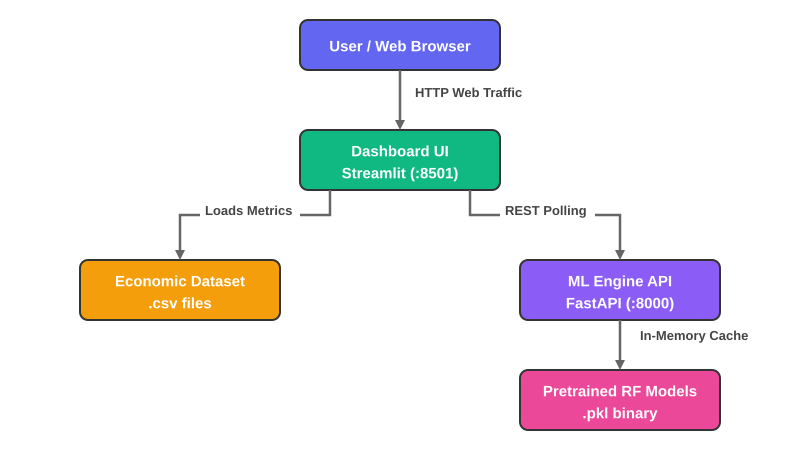
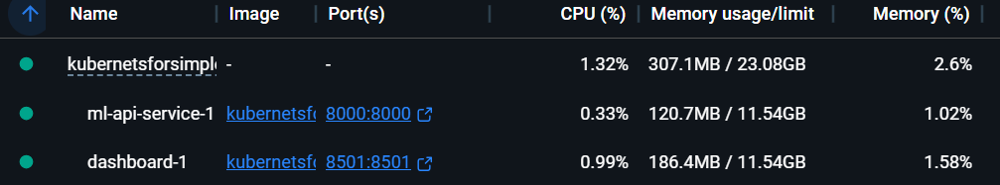

# 🇵🇰 Pakistan Economic & ML Dashboard (Cloud-Native)


An interactive, containerized Machine Learning platform analyzing Pakistan's macroeconomic indicators from 2000 to 2025. It tracks complex metrics like GDP, Export volumes, Remittances, and CPI Inflation while featuring a fully decoupled **Random Forest ML Engine** capable of dynamic, real-time predictions.

---

## 🏗️ Architecture Design

The project has been refactored from a Python monolith into a highly scalable, decoupled microservices architecture designed natively for **Docker** and **Kubernetes**.

<p align="center" style="margin-top: 20px;">
  
</p>

### 1. `dashboard/` (Frontend Service)
Powered by **Streamlit** + **Plotly**. Generates interactive Area Charts, General OLS Regression Scatters, and KPI metric cards comparing YoY delta logic. The UI handles zero machine-learning crunching — it securely passes JSON parameters to the backend HTTP service.

### 2. `api/` (Backend ML Service)
Powered by **FastAPI**. It mounts the binary `joblib` weight configurations stored in `models/` into memory immediately on boot. It provides dual endpoints:
* `GET /metrics/{target}`: Fetches statistical limits, R² scores, and normalized Feature Importances.
* `POST /predict/{target}`: Runs the active model inferences based on dynamic slider positions passed by the UI.

---

## 🚀 How to Run Locally

You can run the full dual-service architecture on any machine with Docker installed, skipping manual package configuration.

```bash
# Boot the multi-container environment in the background
docker-compose up --build -d
```
1. Access the Dashboard: [http://localhost:8501](http://localhost:8501)
2. View the ML API interactive Swagger Docs: [http://localhost:8000/docs](http://localhost:8000/docs)

<p align="center" style="margin-top: 20px;">
  
</p>
---

## ☸️ Kubernetes Deployment

Ready to scale? We have provided native K8s manifests under `k8s/` orchestrating Replication Controllers, Node linking, and LoadBalancers. 

```bash
# 1. Apply the ML API backend first
kubectl apply -f k8s/ml-api-service.yaml
kubectl apply -f k8s/ml-api-deployment.yaml

# 2. Apply the UI LoadBalancer
kubectl apply -f k8s/dashboard-service.yaml
kubectl apply -f k8s/dashboard-deployment.yaml

# 3. Verify rollout
kubectl get pods
kubectl get services
```

*Note: In Kubernetes, the `dashboard` pod maps traffic internally matching `http://ml-api-service:8000` automatically utilizing cluster DNS. No hardcoded IPs needed.*

---

## 🧪 Retraining the ML Model
If you add new data to `data/pakistan_economic_indicators_2000_2025.csv`, you can instantly recalculate all system metrics and update the core Random Forest bounds natively. 

```bash
# Make sure you are in a valid virtual environment (e.g., using 'uv')
uv run models/train_models.py
```
This forces the engine to parse the new data, re-evaluate feature importances, establish new Mean Squared Error ranges, and overwrite the `models/*.pkl` snapshots seamlessly. Rebuild your containers afterwards to cache the new matrices!
